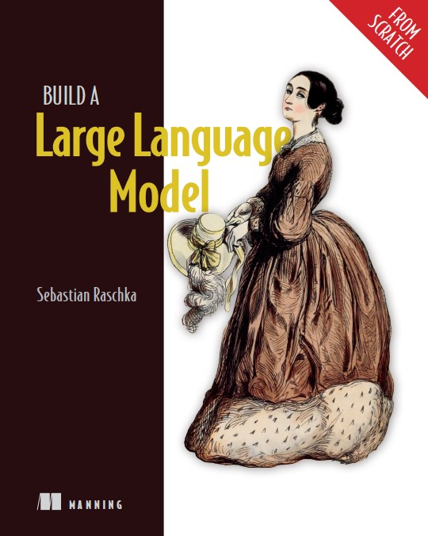

## Building a large language model from scratch
I'm a machine learning / A.I. hobbyist. The technologies fascinate me, and I can't seem to learn enough about them. Sebastian Raschka's book, Build a Large Language Model (From Scratch) caught my eye. I don't recall how I stumbled on it, but I found it when it was still in early access from Manning Publications. I purchased it, and started working through it as the final chapters were being written and released. I just completed the book and all the included work and loved every minute of it.



## My approach
A while ago, I read some advice about learning programming from digital books and tutorials. The advice was to never copy and paste code from samples but to hand-type all the code. I took that approach with this book. I typed every single line of code (except for a couple of blocks which were highly repetitive and long). You can see all my work here: https://github.com/controversy187/build-a-large-language-model

I did my best to work in section chunks. I didn't want to start a section unless I had the time dedicated to completing it. Some sections are pretty short, others are fairly involved and time-consuming.

I built this in Jupyter Notebooks on my laptop, which is pretty underpowered for this type of work. The premise of the book was that you can build an LLM on consumer hardware, and it can perform decently well. As I'm writing this, I'm currently fine-tuning my model locally. My model is about 50 steps into a 230-step tuning, and I just crossed the 20-minute execution time mark. The earlier code samples ran quicker, but the last few sections used larger models, which slowed things down considerably.

I didn't do most of the supplemental exercises. I tend to have an "I want to do ALL THE THINGS!" personality. The drawback is that if I take the time to do all the things, I eventually get long-term distracted and never actually finish what I started. So I sort of rushed through this book. I even took several weeks off around Christmas and New Year's. But I got back into it and powered through the last few chapters.

So, more or less, I read through the chapters and wrote all the mandatory coding assignments.

## Learnings
What can I tell you about large language models? A lot more than I could before I started this book, but certainly not all the things the author attempted to teach me. I'll summarize my understanding, but I could be wrong about some of these things, and I most certainly forgot or misunderstood others.

### Tokenization & Vocabulary
A large language model starts its life by building a vocabulary of text. A massive amount of text is distilled down into a list of unique words. Each word is then translated into an integer because computers like numbers more than they like words. This process is referred to as "tokenization", where the word is replaced with a numerical token. So now we have a list of unique tokens, which is the vocabulary of the large language model.
```python
# Build a more advanced tokenizer
text = "Hello, world. Is this-- a test?"
result = re.split(r'([,.:;?_!"()\']|--|\s)', text)
result = [item.strip() for item in result if item.strip()]

print(result)
# Outputs "['Hello', ',', 'world', '.', 'Is', 'this', '--', 'a', 'test', '?']"

all_words = sorted(set(result))
vocab_size = len(all_words)
print(vocab_size)
# Outputs 10

# Display the first 51 tokens in our vocabulary.
vocab = {token:integer for integer,token in enumerate(all_words)}
for i, item in enumerate(vocab.items()):
    print(item)

# Outputs:
(',', 0)
('--', 1)
('.', 2)
('?', 3)
('Hello', 4)
('Is', 5)
('a', 6)
('test', 7)
('this', 8)
('world', 9)

# In this example, the id 9 represents the word "world". 5 represents "Is". etc.
```
This is where my understanding gets fuzzy. We didn't get very far before that happened, 'eh? Now, we take that massive amount of text we were using earlier to create the vocabulary (or a subset, or totally different text), and we tokenize the entire text. We do this by using the vocabulary we built previously and substituting the words in the training text for their equivalent token value. This is now our training text.

### Model Training & Relationships
With that complete, we can "train" the model. This process involves taking each token in the vocabulary and building a relationship to each other token in the vocabulary, based on those tokens' relative positions to each other in the training text. So if the word "cat" is followed by the word "jump", the model records that relationship. But it also records the relationship of the word "cat" to other words in the text. So "jump" follows "cat", but maybe it does so more frequently when they are close to the word "mouse". And maybe less frequently when they are close to the word "nap". Recording ALL these relationships would require a massive dataset, so the relationships are mathematically reduced and approximated. There are definitely more technical terms to use, and the book went into them. I definitely forget them, though.

### Text Generation Process
Now, if you provide a starter text to the model, it will try to complete the text for you. Continuing our example, if I gave the model the text "My cat saw a mouse and it", based on the word cat being close to the word mouse, it might predict the word "jumped" to come next. So it appends the word "jumped" to the text I submitted, and then it takes that whole new sentence and feeds it back into itself. So now the input text is "My cat saw a mouse and it jumped". The next output word could be "on", so it appends that word and feeds this concatenated output back into its input.

Every time it does a loop like this, it tokenizes the entire input (or up to a limit, known as a context limit or context window) and then calculates the most likely next token, then converts it all back to text for us to read.

### Model Weights & Distribution
Saving all those relationships between the tokens are known as the "weights" of the model. Those can be distributed, so if you train a model on a given training text, you can give that to your friends and they can use those model weights to predict text similar to that training text.

### Fine Tuning
Fine-tuning is the process of training a model for specific... things. My mind is getting fuzzier here, so I'm not going to go into this deeper. Suffice it to say, that you start with a base language model and continue to train it using specific input and output pairs. In the book, we built a spam classifier that determined if a given message was spam or not, as well as a model that will follow instructions. That's actually the one that's being trained right now as I write this post, so I'm not sure how it will turn out. Based on the fact that it's published in a book, I think it will come out just fine.

So while I'm not completely done with the book, I'm very nearly there. I did learn a lot of great concepts, although obviously some of them weren't retained. It would probably behoove me to go back through the book again and quickly breeze through it, in order to refresh my memory and cement my learnings.

## Meta learnings
Other than the technical aspects of Large Language Models, what else did I learn through this experience?

Through my experiment with typing all the code samples by hand, I can say that my time would have been better spent with a different approach. If I do this again, I'll probably not type all the code snippets, but rather "type" them in my mind, and really understand what each line does. The times I learned the most were actually when I made a typo and had to go back through my code to debug it. That forced me to understand what was happening so I could figure out what went wrong.

I learn better with paper, rather than a digital book. I don't know why. I had both available to me, and I read the first couple of chapters in the paper book. That information stuck better. Maybe because it was earlier in the book and simpler to understand, or maybe the format played into it. But I enjoyed it better, regardless.

I didn't have to "figure out" anything, and I think that hampered my learning. There are supplemental exercises in the book, where the author gives you a problem and you have to figure out how to solve it. The answers are given in his GitHub repository. That would have slowed me down a lot, but I'm very confident that I would have learned the material better.

## What's next?
I'm torn right now. I want to understand this material better, but I wonder if getting into lower-level, specific material might help me understand AI and machine learning better. What will likely happen is that I'll copy and paste this content into Claude.ai and suggest a path forward for me.


