## Why?
I have done very little work in Microsoft Azure. I'm very familiar with Google Cloud Platform and the data analytics and AI tools available there, and I'm somewhat familiar with similar AWS offerings. But there's a technical gap in my Microsoft side. I wanted a quick project to gain some familiarity with the platform. The goal will be to do some simple data transformations and analysis on publicly available data, specifically.

To that end, I used two 2023 MEPS files: one that captures person-level demographics, coverage, and expenditures, and another that captures office-based visits at the event level. From there, I shaped the raw data into a simple bronze/silver/gold workflow and used it to analyze cost drivers, utilization trends, and high-cost member concentration. This was all done in a [local Jupyter notebook](https://github.com/controversy187/healthcare_data). Now I'm ready to recreate this in Azure.

## The Plan
Here's the plan. I have the two Excel files, and I'll need to place them in a storage account in Azure. From there, I'll use a Data Factory to process them into Parquet files. One awesome thing about Azure is that I can use Parquet files directly as external tables in Unity Catalog, so I'll register those, then process them into silver and gold Delta tables. From there, I can connect Power BI to the Gold datasets to visualize my business insights.

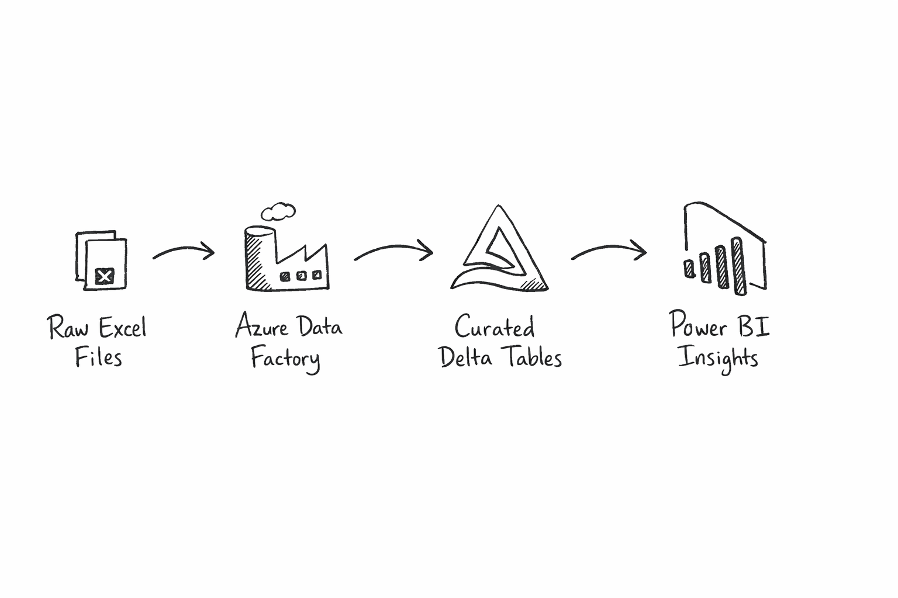

## Landing raw data in Azure
First off, after creating an Azure account and logging in, I create a Resource Group. This seems like it's similar to a Project in GCP. A logical grouping of virtual machines, databases, services, etc. A group of resources. So the name Resource Group makes sense. Seems to be a pretty straightforward process: Find resource groups on the left sidebar menu, click "Create", and type in a Name. It defaulted to the only subscription available, which I assume matters for billing purposes at some point. Select a Region and hit Review + Create. 

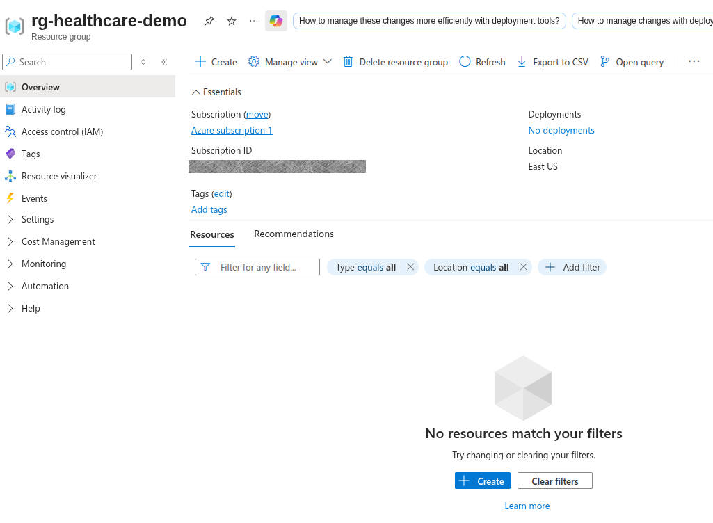

I don't know what data is sensitive in Azure, so I'll block out what makes sense to me :)

Next up, I need a storage account. This will act like a data lake for my demo. So, I click Home, then choose "Storage accounts" from my left menu. Hit create, it pre-populates the fields it can (subscription and my newly created resource group), and then I need to come up with a globally unique storage account name. This seems strange to me. Since it's part of a resource group, it seems that a storage account would naturally be namespaced to the resource group. I'm sure it will make sense later. For now, I'm not going to share my storage account name, since I don't know if they're secret. I change my redundancy to Local, since I'm just messing around and can be cheap. One option I change is up in the advanced tab, I enable hierarchical namespace. That's what makes this available as an Azure Data Lake Storage Gen2 account, which is what I think I want. Review + Create, and I've got a storage account!

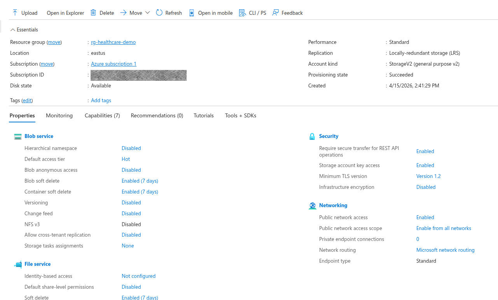

Now that I have a storage account, I need a container. This will be the actual "data lake". Following "Data Storage" to "Containers" then clicking "Add a container" gets me where I need to be. I apparently already have a container called $logs, which makes me happy because who doesn't love solid logging! Adding a container is simple, just give a name. Mine's called "lake". Once it's created, create `raw/meps/2023/`. I saw a message that says that this directory won't actually be created until there are items in it. So I'll upload my two raw data files from MEPs, which I named `h248g.xlsx` and `h251.xlsx`. Those are the MEPS Office-Based Medical Provider Visits file (2023) and MEPS Full-Year Consolidated file (2023), respectively.

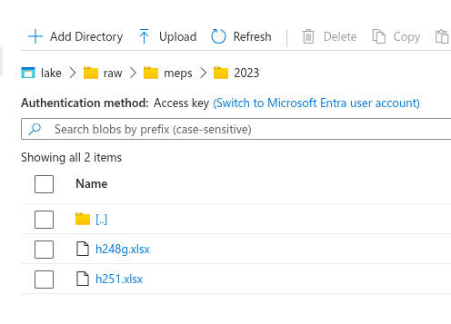


## Creating compute, orchestration, and Excel ingestion

Great! I've got my raw data in its original format, in my Azure data container. Time for my first data transformation in Azure! For this, I'll use Azure Data Factory. I search for "Data Factory" in the search bar and select "Data Factories". I guess Azure likes plurals here. I hit "create", select my subscription and resource group, and give it a name. Turns out that this has to be globally unique, so be mindful of that. Review + Create button, and I've got a Data Factory! Interestingly, once the factory is created, it takes me back to my resource group, and it shows both my factory and my storage account. So my resource group really does seem to be a just a collection of all the resources I've created.

Before that, I need to create an Azure Databricks Workspace. Searching the top bar for Databricks gets me there pretty easily. Easy clicks, basically selecting the defaults and giving the workspace a name. It took a couple of minutes and was successful. Now I'll go back to the Data Factory I built earlier and launch the studio. From here, I can create a linked service for Azure Data Lake Storage Gen2. This was enabled a few steps ago when we created the storage account and checked the box for hierarchical namespace. When I try to test the connection, though, I get an error that this endpoint doesn't support BlobStorageEvents or SoftDelete. So I navigate back to my storage account, turn off blob soft delete and container soft delete, and hit Save.

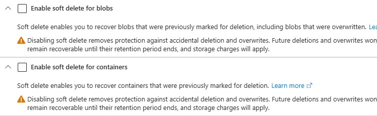

Going back and trying to create the Azure Data Factory linked service to the Azure Data Lake Storage Gen2 worked this time! That gives my factory access to my storage account. That means I can read my raw Excel files, and I have the ability to write out my bronze data set. It's not doing anything like that right now, but it's defining that connection.

Next, I'm going to create a linked service in my factory to Azure Databricks, which will, in turn, trigger Databricks notebooks after the Excel ingestion step. So, on my linked services page in my Data Factory, I click "+ New" at the top. I select Azure Databricks, but I hit another blocker. Apparently, I need an Access Token for my Databricks workspace.

So I navigate to the Databricks I created earlier, I find Access Tokens in the developer settings. I set a max lifetime of 120, and then select All APIs for the API scope, because I don't yet know exactly what APIs I'll be needing. Then I copy my API token and save it in a safe place, since I'll only be able to see it at this time.

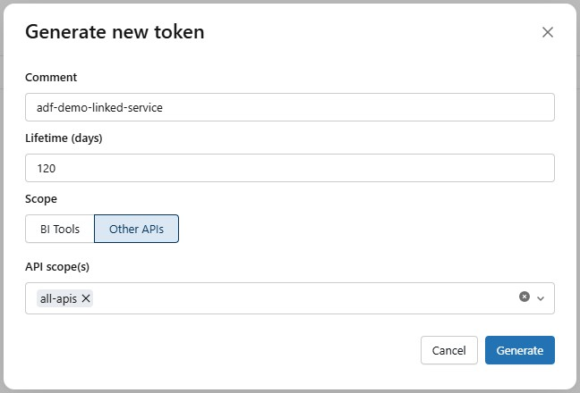

Back on my Azure Databricks Linked Service page in my data factory, I paste in my access token. Then I can select my Cluster Version, Cluster node type, and I went with Python 3 because that's what I'm more familiar with these days. Hitting Test Connection resulted in a success, so I hit Create!

Now, back to my Data Factory page, I create a new Excel dataset, since that is what my source files are. I had to generate a smaller version of the excel file with 250 rows chosen at random. The original file was too large for the connector to parse to determine the schema, so the smaller sample file will allow it to understand the structure of the data.

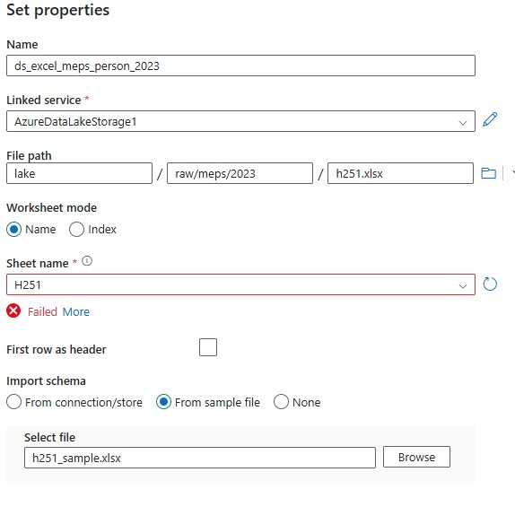

I repeat the process for the visits dataset, and then publish them both. I validate the schema for the visits dataset. The person dataset has too many columns to display. Previewing the data looks pretty good, too! 

Now it's time to create the bronze sink datasets in Azure Data Factory. We're going to go with Parquet instead of CSV for this because it's a little more data-friendly for both analytics and preserving data types. I create them the same way that I loaded the .xlsx datasets, but I'm not defining a schema for them, since the files don't exist yet. Now we have our source files and bronze data sinks defined.

We're getting very close now, so it's time to build the Data Factory ingestion pipeline. In our Data Factory, we go to Add New Resource, Pipeline, Pipeline. I'm calling it `pl_meps_excel_to_bronze`. I add a Copy Data block and set the source to `ds_excel_meps_person_2023` and the sink to `ds_bronze_meps_person_parquet`, since that's what I named my source and sink. For the copy behavior, I chose Preserve Hierarchy. I repeat these steps to create a second Copy Data block. They can run in parallel, so I don't need to orchestrate them any differently from what they are. I hit the validate and debug buttons to make sure things are working properly. The person copy took significantly longer than the visits copy, but in the end they both came back successfully. 

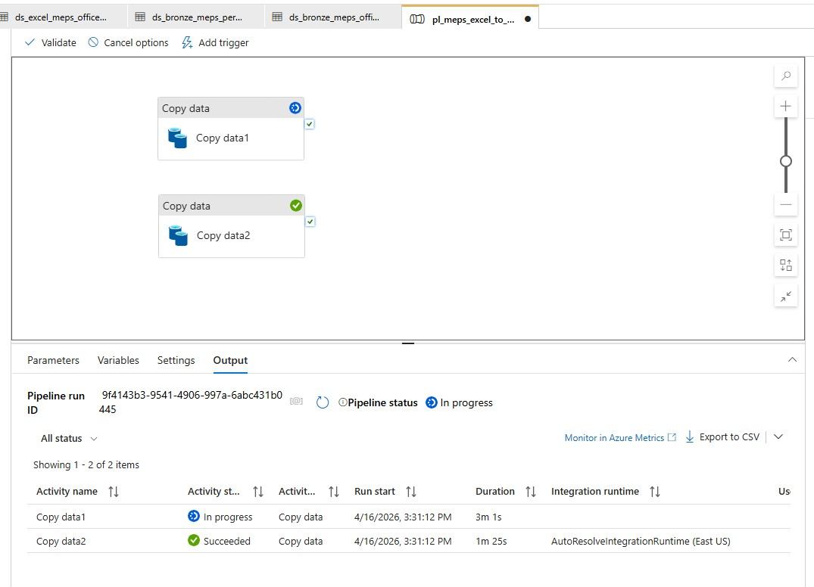

Once those tests work, I triggered them for real. It took my Vists copy a little over a minute to run, and my Person copy clocked in around seven and a half minutes. Going back to my dataset in my Data Factory, I chose my person parquet dataset, selected Preview, and voilà! I see my Bronze data!

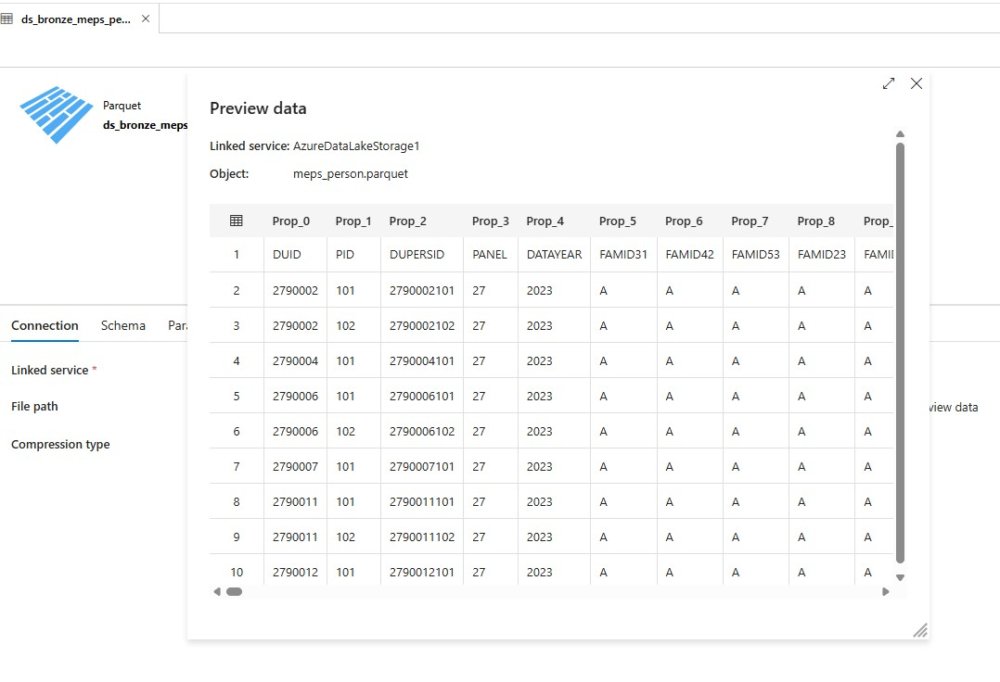

## Build Silver data layers

To actually start manipulating the data, we need to use Databricks. After opening the Databricks workspace, I create a compute resource. It's pretty straightforward, and I didn't change any of the options. That should give me resources to run notebooks on. From there, I hit the Workspace link on the left, create a directory called `healthcare_demo`, and then create notebooks for each step of my translation. 

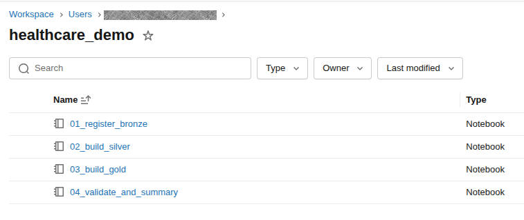

Now that I'm starting to actually build things, I need to make sure that they stay organized. For that, I'm turning to Unity Catalog. I create three schemas, `bronze`, `silver`, and `gold`. Once that is complete, I write my first code in my Bronze notebook to read in the parquet files that my data facto
ry created. Before I can execute it, though, I need to set up my access.

A search for "Access Connector for Azure Databricks" at the top of my account gets me where I need to go. After creating a new connector for my resource group, I open my storage account and go to IAM. From there, add my newly created access connector as a member. Now, back in the Catalog, I hit the gear icon and choose "Credentials". Clicking Create Credential brings me to a screen where I can give it a name and paste in the Resource ID from the Access Connector we just created.

Finally, I need to create the external location, so back in my Catalog, I hit my gear icon and go to External Locations and Create External Location. I give it the most amazing name I can think of, use the location `abfss://lake@sthealthcaredemo12345.dfs.core.windows.net/bronze/meps/2023/` (yours might not match mine), and choose the storage credential I just created. When I tried this, I got an error that Hierarchical Namespace was not enabled, so I went back to my Storage Account, and, sure enough, Hierarchical Namespace was disabled. I clicked it and it brought me to a walkthrough to enable the feature. 

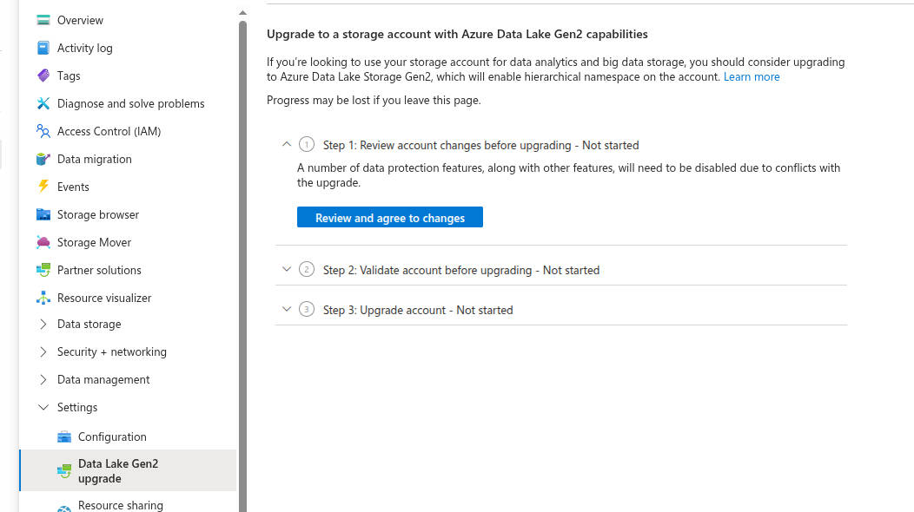

The upgrade went smooth. It warned me that it could take several hours, so I went and did other things for a while. Interestingly, when I came back to it a half hour later, there was an ajax error on the page, but navigating back to the configuration page showed that Hierarchical Namespace is now enabled. So, back, to creating the external location, and... success? Kind of? I got a message about File Events Permissions not being verified. I'm not quite sure that means, so mental bookmark, and I click "Force Create". Great Success!

Now, since I already have my bronze parquet files and I now have an external location, I want to register those as external tables in Unity Catalog. After going to the SQL Editor, I just run the following SQL calls:

```
CREATE SCHEMA IF NOT EXISTS demo_healthcare.bronze;
```
```
CREATE EXTERNAL TABLE IF NOT EXISTS demo_healthcare.bronze.meps_person_raw
USING PARQUET
LOCATION 'abfss://lake@sthealthcaredemo12345.dfs.core.windows.net/bronze/meps/2023/person/';
```
```
CREATE EXTERNAL TABLE IF NOT EXISTS demo_healthcare.bronze.meps_office_visits_raw
USING PARQUET
LOCATION 'abfss://lake@sthealthcaredemo12345.dfs.core.windows.net/bronze/meps/2023/office_visits/';
```

When I go to the Catalog, I can now browse my parquet files as SQL tables! At this point, I want to test access from my notebooks to the tables, and not read the raw parquet files. I rewrite my first cell to be

```
bronze_person_df = spark.table("demo_healthcare.bronze.meps_person_raw")
bronze_office_visits_df = spark.table("demo_healthcare.bronze.meps_office_visits_raw")

print("Bronze tables loaded successfully.")
```

and after it runs, I can access the data in a dataframe like I'm used to!

```
print("bronze_person_df row count:", bronze_person_df.count())
print("bronze_office_visits_df row count:", bronze_office_visits_df.count())
> bronze_person_df row count: 18920
> bronze_office_visits_df row count: 135096
```

Interestingly, my bronze row data now shows 18920 records for the person dataset. When I ran my analysis locally, it showed 18919 rows. This is likely just a header row discrepancy, but it's best to make sure.

`display(bronze_person_df.limit(10))` shows me `['Prop_0', 'Prop_1', 'Prop_2', 'Prop_3', 'Prop_4']`

Sure enough, the service autogenerated column names because it interpreted the first row as data, not as headers. I must have missed a checkbox somewhere. Back in my Data Factory, I go to Author > Datasets and choose my Person dataset. Frustratingly, "First row as header" is unchecked, so I check it, go to the Schema tab, and upload my sample I originally used. I see the proper header names now. I double-check that it's checked for the office visits dataset as well. Also, I go to my Parquet dataset for Person, and import the schema again, since that will now be different, and then I hit Publish All. Back to my pipeline, and I trigger them again to generate new parquet files, and I run my SQL to recreate the bronze SQL dataset, since the schema changed. That didn't actually fix it, but when I deleted the SQL table for the Person data and created a new one, appending v2 to the end of it, it worked. Interesting quirk.

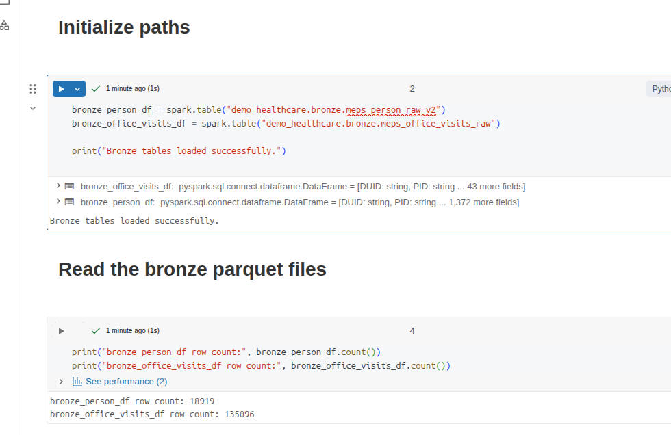

Finally! I have our bronze data landed in my system and accessible. In the silver layer, I'm looking to have the data cleaned up. Consistent, readable, correct typing, and easy to build gold tables later, which will be used to answer various business questions.

This will be a lot of SQL and Python in a notebook, so I'm not going to add all the code here. At some point, I might add it to my GitHub repo so you can see what I'm doing. Reach out and let me know if you're interested in that. For now, I'll be working in my 2nd Notebook, since the first is basically loading the data from the Bronze (raw) dataset and validating that it came through the pipeline ok.

Basically, in my notebook, I do the following:
1. Load the bronze tables
2. Inspect the tables, just to validate that they are what I'm expecting
3. Normalize the column names to lowercase to make things easier downstream
4. Create new dataframes from the large datasets, selecting only the columns I need
5. Build the `silver.member` dataset with the following criteria:
	-	Rename technical source fields to business-friendlier names
	-	Keep the raw code columns for traceability
	- 	Add decoded label columns for readability
	-	Derive age_band
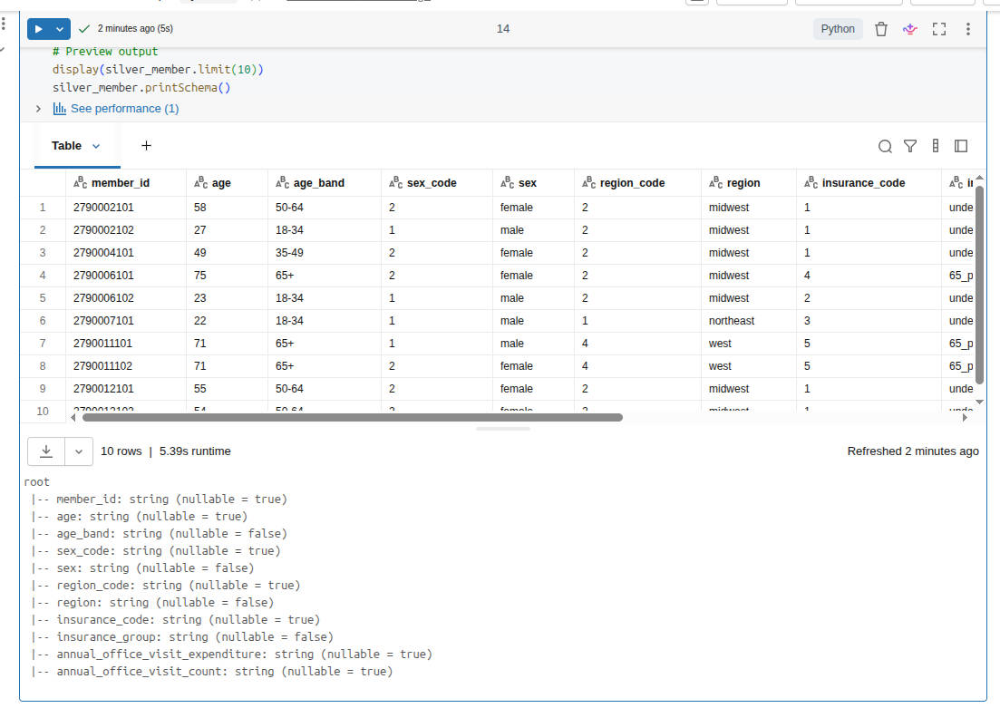
6. Similarly, build the `silver.office_visit` dataset
	-	One row per visit
	-	Keep both charge and expenditure
	-	Preserve coded values and friendly labels
	-	Create a usable date
	-	Add visit_count = 1 to make later aggregation easy
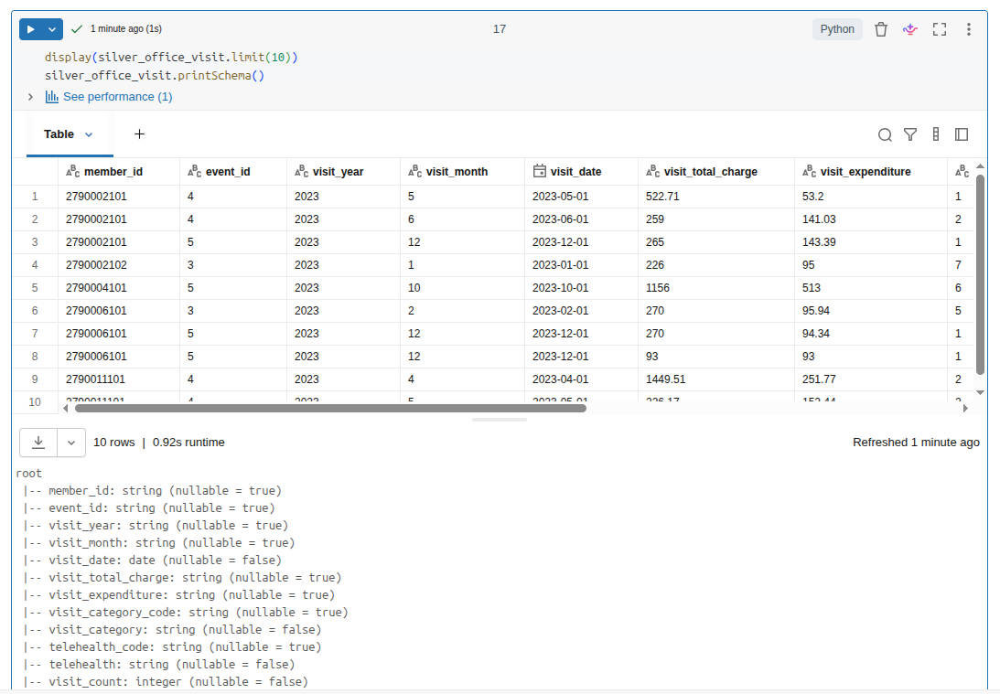
7. Check data for weird occurrences of nulls, obviously incorrect row counts, or unexpected values
8. Create my schema, if it doesn't already exist
9. Write the data to the tables

So, a decent amount of data manipulation, and then I write out data to the tables. Fortunately, my spot check of data looked fine, and my row counts matched between inputs and outputs, which was expected. So I now have a Silver dataset!

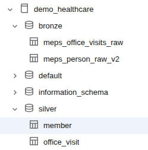

## Build Gold data layers

I'm on a roll now, so it's time to start shaping the data into business-ready outputs. Example questions I might be able to answer are:
- Who are the high-cost members?
- How does utilization change month to month?
- Which segments drive the most spend?
- What patterns would a benefits stakeholder care about?

Similar to the silver dataset, I'm not going to drop all my code in here. I'll just summarize my notebook. Here's what I do:
1. Load the Silver tables.
2. Build `gold.member_annual_spend`. This gives me insights such as:
	- annual spend
	- annual visit count
	- segment fields
	- a high-cost flag (is this person in the top 10% of spenders?)
3. Build `gold.monthly_utilization`. Shift from event-level rows to month-level business summary.
4. Build `gold.spend_by_segment`. Comparison of age bands, insurance groups, and regions.
5. Build `gold.high_cost_members`. Just a filtered view of members who cross the 10% threshold.
6. Write the Gold tables so they are accessible to the business.
7. Validate the Gold layer.

This is a far less technical exercise and more of a business analytical exercise. I tried to ask simple, but relevant, questions that these two original datasets might help answer. After crafting the datasets around this analysis, I chose to write them as Gold datasets so that we can start querying them directly, instead of having to compute the analysis every time. In production, I would be more aware of the context of the questions. Does this data need to be real- or near-realtime? Then we might benefit from calculating the Gold data at the time of analysis, assuming that our Silver dataset is changing frequently.

Now that I have my notebooks written that translate from Bronze to Silver to Gold, I want to build out my whole pipeline. Currently, I'm only using my data factory to copy from the Excel files into parquet files, which are then mapped to the bronze delta tables. Let's mature this pipeline a bit!

## Building the data pipeline
I go back to my Data Factory. After loading my Pipeline, I find the activity for Notebook, drag that onto my pipeline, and name it `nb_build_silver`. I browse to my 02_build_silver notebook that I built and select it. After that, I repeat those steps but load in my 03_build_gold notebook instead. Once all my components are in, I start connecting them. Dragging the checkmark from each of my Copy Data blocks to my nb_build_silver block ensures that they _both_ run before the silver block executes. Then, I drag the checkmark from Silver to Gold. Because I'm using the checkmark spot, these will only continue execution when the previous block is successful. If this were production, I would have a validation notebook that would check row counts, existence of required data (high-cost threshold), etc., and have that execute. For now, we'll just rename the pipeline to `pl_meps_excel_to_gold` and run it!

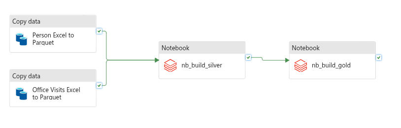

Oh no! When I ran it in debug, my nb_build_silver activity failed with the message `Standard_DS3_v2 is currently not available in location 'eastus'.` I'm not sure exactly why this happened, but I make a mental note to revisit this later. In the meantime, I open up my Azure Databricks Linked Service in the data factory and switch the "Select Cluster" from "New Job Cluster" to "Existing Interactive Cluster" and select the cluster that exists there. I'm not sure what this is, or why it's different, but I'm looking forward to understanding this whole process better.

I debug the pipeline again and let it run. This time it ran successfully! My silver notebook took over 13 minutes to run, which seems slow to me. When I ran it from the notebook itself, each cell took less than a minute to run. In production, I'd probably pare down this notebook to not have as many sanity checks and simply be data processing. For now, I'll claim victory in completing a full end-to-end pipeline that takes raw Excel files and transforms them into business-ready Delta tables! Next up, Power BI visualizations!

## Power BI Visualizations
First, I make sure that I have Power BI Desktop installed. Then, I go into my Databricks workspace, go to the Marketplace, and search for Power BI Desktop Partner Connect Integration. I connect it to my cluster, and then download the Connection file. This opens in Power BI. I use Ubuntu as my daily driver, but I'm using my Windows installation for these steps. Once I'm logged in and connected, I choose my gold Delta tables registered in Databricks, specifically

- demo_healthcare.gold.member_annual_spend
- demo_healthcare.gold.monthly_utilization
- demo_healthcare.gold.spend_by_segment
- demo_healthcare.gold.high_cost_members

As I select these, I'm pretty excited to see the data that I've curated appearing in a desktop application. Intellectually, I now know how it all works, but it's still pretty neat to see the fruit of my labor appearing here. I hit the Load button and it starts populating the data.

It turns out that adding simple visualizations in Power BI is... well... simple! I won't go into detail here, since my goal was to focus on the Azure side of data analytics.

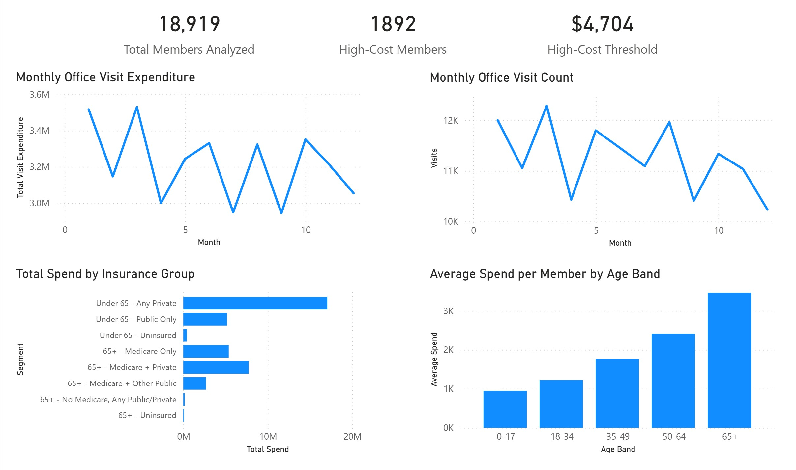

From this, we can see that if someone is paying more than $4,704 per month, they are in the top 10% of members. Our largest spenders are the 65+ age bracket, which makes sense. Interestingly, the largest total spend is from those under 65 with private insurance. This could be due to the total number of members in that group, rather than their average expenditures. Further analysis would be necessary, and really quite simple with the data that I've curated! 

## Wrapping it all up
All around, it was a joy to work in Azure. I hit a couple of "gotchas" that I'm still digging into, such as the timeouts on my compute, and having to create a new Delta table to house my corrected schema when I accidentally included my column headers as data. I learned about storage locations in Azure, processing data pipelines with a Data Factory, managing the three layers of data (Bronze, Silver, and Gold), and how to go from raw data into useful insights in an automated fashion. There are several areas for production hardening here, like logging, validation of my Data Factory steps, notifications, scheduling and triggers, etc. But for now, I'm pretty happy with what I've built in pretty short order!
