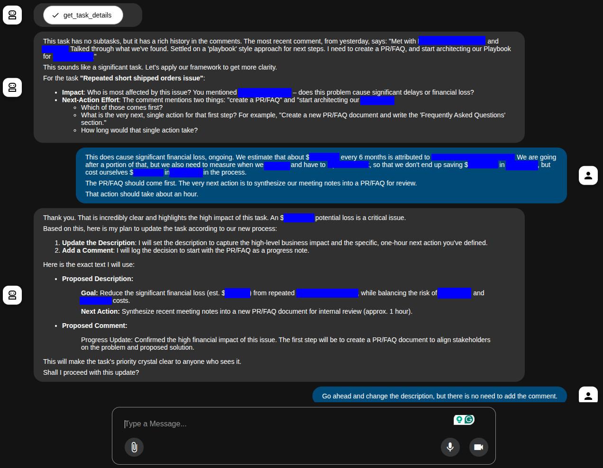
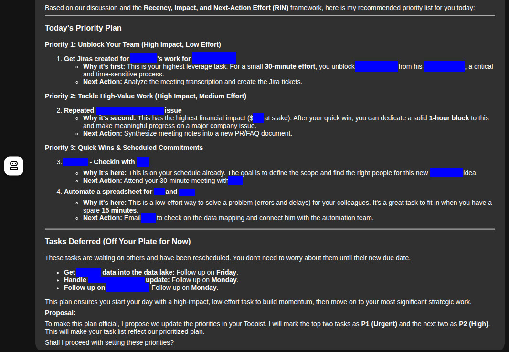
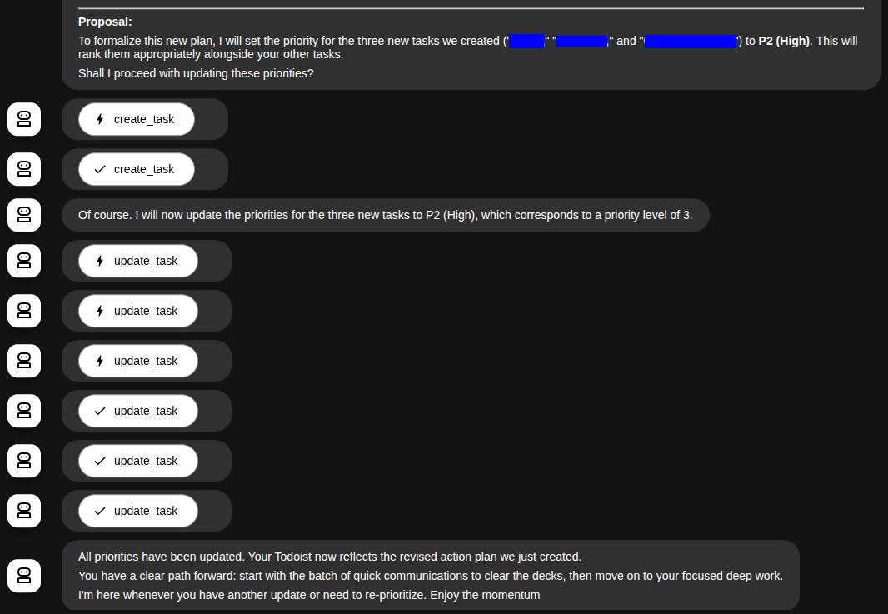

## My Todoist Was a Mess

I've been a loyal Todoist user for years. It's been my trusty sidekick for keeping my work organized. But recently, things got a little out of hand. A small internal restructure at the organization I work for meant my workload grew significantly. More projects, more stakeholders, and a couple more people on my team. And a constant stream of new tasks hitting my inbox. I was struggling to keep my head above water. I was busy, but I wasn't making progress on the things that actually mattered.

I knew I needed to do something different. One of my teammates had been experimenting with the [Google ADK (Agent Development Kit)](https://github.com/google/adk) and it got me thinking: could I build my own AI assistant to help me make sense of the chaos?

## Why I Chose Google ADK

I'd seen some cool demos of Google ADK, but I wanted to see if I could use it to solve a real-world problem. My teammate was using it to pull data in from BigQuery and make sense of it. My problem was simple: I needed to figure out what to work on next. I needed a way to cut through the noise and find the high-impact tasks that would actually move the needle.

## Building My AI Assistant

I'm not a professional developer, but I like to tinker. I started by sketching out what I wanted my AI assistant to do:

*   Talk to Todoist to get my tasks.
*   Help me figure out which tasks were most important.
*   Give me guidance on what to work on next.

With Google ADK, I was able to create a few different "agents" that worked together:

*   A **Smart Prioritization Agent** that looks at how recent a task is, its impact, and how much effort it will take.
*   A **Project Manager Agent** that helps me break down big, scary tasks into smaller, more manageable ones.
*   A **Coordinator Agent** that figures out which agent to send my requests to.

I also set up a simple rule: all the details about a task go in the description, and any updates or decisions get logged as comments. This keeps my Todoist nice and tidy.

## How It Works - A Refinement Session

> 

Most of my tasks in Todoist were simply one-liners where I captured a thought of a task, to be done or prioritized later. I didn't want to lose track of them. But they didn't have a lot of context or detail. So the first thing I needed to do was to refine my backlog of tasks. My ADK tool does just that, when I tell it that I want to. It pulls in all my open tasks, reads the descriptions and comments, and asks me questions to fill in any blanks.

## How It Works - Prioritization

> 

Once I had all my tasks refined, I can ask my agents to tell me my top priority tasks for the day, and it will present me with a game plan. These are prioritized based on how recent the most recent action was taken on a task, what the anticipated impact of the task is, and how much effort my next action is.

Finally, it updates my tasks in Todoist with the new priorities and any notes we discussed.

## The Results

The difference has been night and day. Instead of staring at a giant list of tasks, I get a clear, actionable plan every morning. I know what I need to work on, why it's important, and what the next steps are. I feel like I'm back in the driver's seat, making real progress on the things that matter.

## Bugs

> 

The most common bug that I have is that sometimes the Agent says it will wait for my input, but then it goes ahead and executes whatever changes it wants to. As a safeguard, I don't have an tool set up for completing a Task. I don't want to lose any tasks if I'm not paying super close attention to it. Plus, I don't want to give away that task-completing-dopamine-hit to anyone other than me. Gotta feed my addiction ;)

Also, one time it created four copies a task. So watch out for that.

## What I Learned

This was my first time really diving into Google ADK, and it was a lot of fun. I learned a ton about how to design and build AI agents, and I got to play with some cool new technology. But more importantly, I built something that actually makes my life easier.

If you're feeling buried in your to-do list, take a look at [my project](https://github.com/controversy187/todoist-adk). It's a somple tool, and sometimes the best way to learn something new is to build something that solves your own problems.