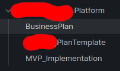

## My Journey with MCP Servers

I recently learned of MCP (Model Control Protocol) servers through a [post on Hacker News](https://news.ycombinator.com/item?id=43410866). The premise seems really neat. MCP is essentially a protocol that allows AI models like Claude to interact with external tools and services through a standardized interface. I can write a very simple server and create "tools" for the Claude.ai desktop application to connect to and use. The example in the post created some tools that gave Claude access to read and write to the local filesystem (unrestricted, by the way). The original intent was to have Claude write some application. I cloned and ran the [sample MCP server](https://github.com/ZbigniewTomanek/my-mcp-server) from the article to play with it, and was immediately impressed. This unlocks so many opportunities to integrate an LLM with countless services!

Hold on to that thought...

## My Second Brain
For the past several years, I've been using Tiago Forte's [Build a Second Brain](https://www.buildingasecondbrain.com/) method using Obsidian.md for my second brain. I implemented the [PARA Method](https://fortelabs.com/blog/para/) for organization, and create a Daily Note every day to link my chronological life to my disorganized brain. It's been a good system, even if I don't use it to it's fullest. At the very least, I have all my notes synced with me between my desktop, laptop, and phone, thanks to Syncthing. That being said, Obsidian's search capabilities are relatively lackluster.

This is where my MCP server can help. 

## Getting things going
To get it all setup, I basically cloned the MCP server linked above, and then set it up as they described, creating the server config in the Claude Desktop app. Since I'm running Linux, I had to [hack around a bit](https://github.com/aaddrick/claude-desktop-debian) to get the Windows Claude client running, but it works fine. With the MCP server connected, I now showed that I had several tools available to Claude.


After some sample queries, I validated that Claude now had full access to my filesystem!

## Plumbing the depths of my second brain...
Since I write a Daily Note every day, I first asked Claude to summarize my daily notes for the month of March 2025. It came up with accurate and surprisingly detailed insights.

```
March 2025 Daily Notes Summary
Personal Life
Family Activities:

Started the month at ****** with the ****** and ****** families, though you noted it was chaotic with misaligned schedules
Went skiing with ****** at Crystal Mountain on March 10th, where you had a meaningful father-son conversation about life and relationships
Your daughter ****** attended Middle School Ministry several times
References to your family (******, ******, ******, ******) appear consistently throughout the month

Fitness:

Maintained consistent workout schedule with 15 recorded workout days
Primarily practiced Jiu-Jitsu at ****** (both gi and nogi classes)
Also incorporated running into your fitness routine
Tracked your weight throughout the month, ranging from 179 lbs to 187 lbs, with an average around 182 lbs

Spiritual Practice:

Maintained daily quiet time starting mid-month (March 18-31)
Studied the Gospel of Matthew, progressing sequentially from Matthew 12:38 through Matthew 14:33
Each quiet time session appears well-documented with dedicated notes

Professional Life
Regular Meetings:

****** (almost daily)
Weekly kickoff meetings (Mondays)
One-on-one meetings with various team members including ******, ******, and ******

Key Projects:

****** Rush Orders project with weekly check-ins
****** project with multiple coordination meetings
Corporate Injury Analysis work
Supply Chain ****** activities and meetings
Non******stock ETA modeling work (created ******)

Professional Development:

Participated in Looker Studio training for data visualization
Worked on Google Maps Optimization POC
Set up Gemini in VSCode
Explored Jira metrics via API

People Management:

Reached out to ****** about a ******
Provided feedback on ******'s Flow Metrics presentation
Worked with various team members including ******, ******, ******, and ******

Your month shows a balanced life with consistent attention to physical fitness, spiritual growth, family time, and professional responsibilities, with a particular focus on data and supply chain projects at work.
```

This was great! For years, my Second Brain has been a storage device. I had the ability to go back and manually retrieve that information, but I had to read the notes into my short-term (actual) brain, and hold it there while I search for other information to connect it to. Obsidian and the Second Brain method make this simpler by encouraging the use of internal links in notes, but now I had another tool for synthesizing meaningful information from all these connections!

### Creating Notes
Equipped with a tool for analyzing my second brain, I turned toward project management. I've had a few ideas for side projects that I wanted to flesh out a bit. I've worked with LLMs in the past to bounce ideas off and refine some thoughts, but now I could generate documentation around these ideas, store that information, and retrieve it later for ongoing processing and development! I took a conversation about a project I'm thinking through, described my desired goal, and then asked Claude to develop a plan for a low-code, low-cost MVP to test market fit. It described the approach, I refined it a bit, and then asked Claude to store the project documentation in my Obsidian Vault. Boom, project plan and action steps created!



### Reflection
MCP Servers seem extremely powerful. For such a long time, LLMs have seemed contained to limited use cases. Plugins for code editors have allowed functionality in coding and chatbots are common. Further integrations have required the use of APIs and coding to leverage the power of LLMs in other contexts. Now, with MCP Servers, it really feels like we have simple-to-create interfaces that allow LLMs to interact with the rest of the digital world. What will you create? 
