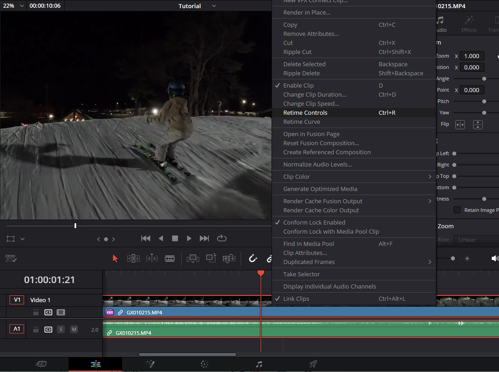
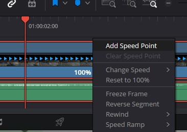
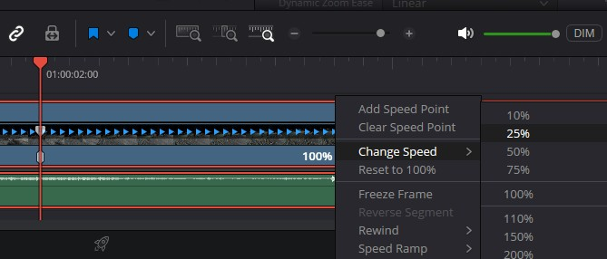
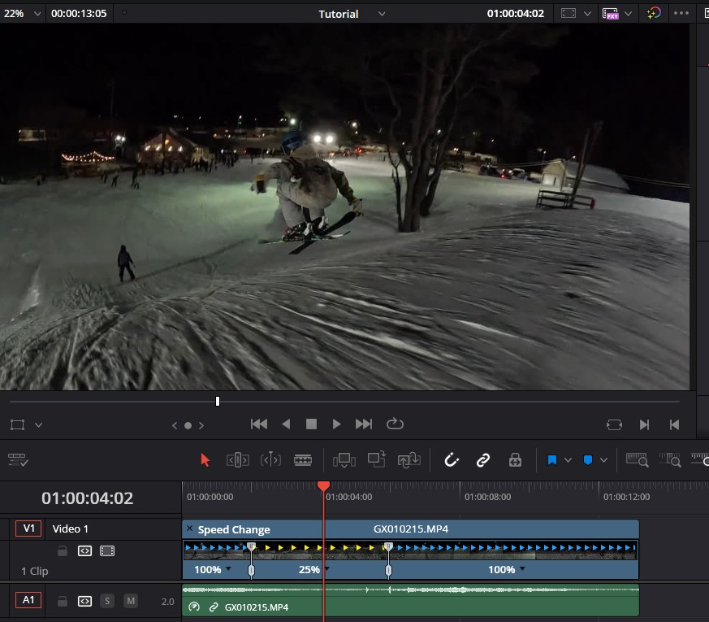

## Controlling clip speed in DaVinci Resolve
This is the process I just learned for adjusting speed within clips in DaVinci Resolve 19. This isn't an adjustment for an entire clip, but portions of a clip. You can see the use-case in several of the shots [here](https://www.youtube.com/watch?v=IymFBGIcqcI). In the past, I’d cut a clip where I wanted the speed to change and adjust the middle section’s speed, turning one clip into three.

## Adjust clip speed using Time Controls
I'll use the last clip from the above video as a tutorial. The first step is to select the clip you want to adjust on your timeline, in the Edit tab. Right-click the clip and select "Retime Controls" (ctrl+R on Windows).

You’ll see blue triangles pointing right. Move your playhead (the timeline cursor showing your current frame) to the frame where you want the speed change to start. At the bottom of the clip on the timeline, you should see an indicator that shows "100%" followed by a downward facing triangle. Clicking that triangle pops open a context menu. From there, select "Add Speed Point."

This functions like a keyframe, if you've done other video effects or editing in the past. With that divider there, you can see the clip is effectively bisected at the frame you have selected, and each side shows 100%. Now, you can select either side (I'll use the right-side) to adjust the speed. Clicking the black down arrow there allows you "Change Speed" to a handful of preset options. I'll select 25%.

Now the arrows change color and extend. Effectively, you have created another clip, with a slower speed. To resume normal speed later, move your playhead to that spot and add another speed point (via the black arrow). Then reset the right side to 100%. Your final result is a clip that runs at normal speed, slows down in the middle, and resumes normal speed at the end!
